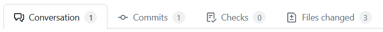
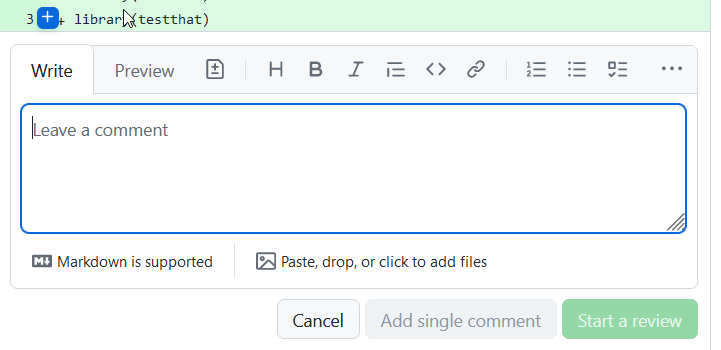
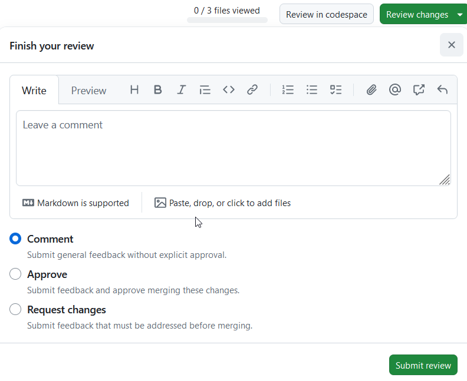

::: {.callout-note collapse="true" title="Document development, review and version history"}
***Development and Review***

Authored/revised by:

`#set align(center)`{=typst}

| Name                     | Date       |
|:-------------------------|:-----------|
| Alan Haynes,[^1]         | 2025-01-01 |
| Charlotte Micheloud,[^2] | 2026-07-13 |

`#set align(left)`{=typst}

***Version History***

`#set align(center)`{=typst}

| Version | Date | Author(s) | Summary of Changes |
|:---------------|:---------------|:---------------|:-----------------------|
| 1.0 | 2025-01-01 | Alan Haynes, | Initial version |
| 1.1 | 2026-07-13 | Charlotte Micheloud, | Adding the reviewer assignment process |

`#set align(left)`{=typst}
:::

[^1]: Senior Statistician, Department of Clinical Research (DCR), University of Bern

[^2]: Biostatistician, Swiss Cancer Institute, Bern

Once someone has prepared one or more tests for functions in a package and submitted them to be incorporated into the platform via a pull request. They should then be reviewed by another member of the platform, ideally from another unit, to check that the tests are programmed and documented appropriately.

<!-- ```{mermaid} -->

<!-- DOUBLE ARROWS CONVERTED TO SINGLE ARROWS -->

<!-- flowchart LR -->

<!--   a[Tests written] -> b[Pull request to incorporate] -->

<!--   b -> c[Reviewers chosen]  -->

<!--   c -> d[Code reviewed] -->

<!--   d -> e[Review approved] -->

<!--   d -> f[Suggested improvements] -->

<!--   f -> g[Author improves tests] -->

<!--   g -> d -->

<!-- ``` -->

## Who reviews?

*Reviewer assignment process*

-   The reviewer assigner (RA), a member of the R Validation Steering Committee, maintains a reviewer list, a randomized sequence of CTUs, weighted by the number of Statistics Platform members affiliated with each CTU.

-   The RA is signed up as 'observer' on the [validation tests GitHub repository](https://github.com/SwissClinicalTrialOrganisation/validation_tests) and received a notification every time a Pull Request is made.

-   The RA then contacts the contact person of the next CTU on the reviewer list, asking them to assign a reviewer (among their team/CTU) to review the pull request with a deadline of one month. 

-   If the contact person replies stating that they decline to assign a reviewer or the package comes from their CTU, the next CTU is contacted. The CTU which was skipped is set to the next on the list. 

-   The contact person replies with the name of the reviewer and their contact details. 

-   The RA indicates on the reviewer list (stored in Sharepoint) and on the pull request that the reviewer has been contacted.

-   After three weeks, the RA sends a reminder to the reviewer with the contact person in CC.

-   If needed, the RA sends another email after the deadline has passed.  

<!-- -->

-   When the task is finished, the RA indicates it on the reviewer list and on the pull request. 

<!-- All pull requests are by default automatically assigned to one individual per unit. These individuals should agree among themselves who can perform the review, potentially nominating someone else from their unit. Those that will not be performing the review can be removed from the list of assignees. -->

::: callout-note
If you need a review urgently, reach out to someone by other means (e.g. email) and arrange that they perform the review for you.
:::

## Performing the review

The review is performed within the pull request on GitHub. There are four main tabs the pull request screen on GitHub:

{fig-align="center"}

-   The conversation tab is for discussions of general points about the pull request.
-   The commits tab lists the individual commits that make up the pull request. For our purposes, this is rarely of use.
-   The checks tab shows the results of automated checks that are run on the pull request. As we have no automated checks running for this repository, this tab is also not useful.
-   The files changed tab shows the changes that have been made in the pull request. This is where the review is performed.

The files changes lists all changes in all files modified during the pull request. The reviewer should look at each file in turn, checking that the changes are appropriate and that the code is well written and documented. The reviewer should also check that the tests are appropriate and that they test the correct things. Also, ensure that the details of the test in `info.txt` match the tests that were actually performed.

Where there are general points to be made, these should be made in the conversation tab. For specific points, the reviewer can comment on the specific line of code in the files tab.

1.  hover over the line to be commented on
2.  click on the `+` that appears
3.  type the comment in the box that appears

{fig-align="center"}

4.  click on `Start a review` to submit the comment

To indicate that you have checked a particular file and that it is suitable, you can click on the Viewed box on the top right of each file.

The very top of the page has a box for finalising the review.

{fig-align="center"}

If there are no issues, the review can be marked with approve. If you have suggestions or require modifications, you can mark it as request changes. If you have questions, you can mark it as comment or request changes, whichever is most appropriate, and enter your questions in the box.

## Incorporating the tests in the repository

Once the tests have been reviewed and found to be suitable and appropriately documented, the pull request needs to be merged into the repository. Each CTU has at least one nominated individual that can perform a merge (typically the same individuals distributing reviews). This individual should check that the review has been approved and then merge the pull request using the green button at the bottom of the conversation tab, followed by the "confirm merge" button that appears afterwards.
